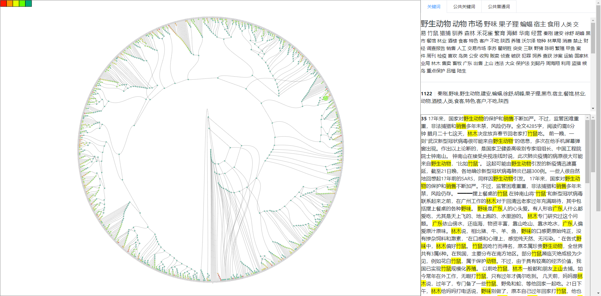

# interface
文本集合可视化Web系统

Web系统访问链接：http://localhost:8080/#/tree2

根据文本相似性构建文本层次聚类树来进行可视化。




## Project setup
```
npm install
```

### Compiles and hot-reloads for development
```
npm run serve
```

### Compiles and minifies for production
```
npm run build
```

### Run your tests
```
npm run test
```

### Lints and fixes files
```
npm run lint
```

### Customize configuration
See [Configuration Reference](https://cli.vuejs.org/config/).
